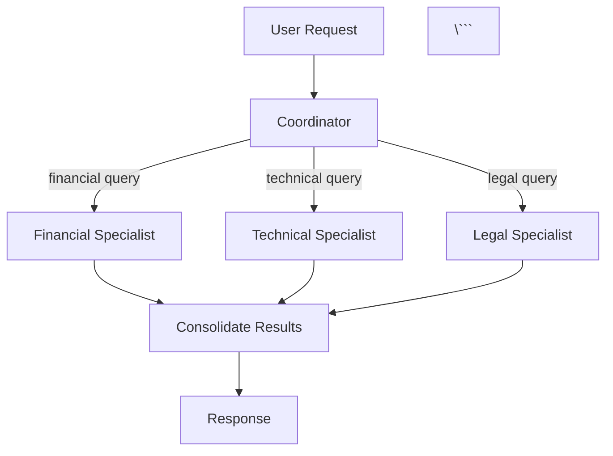

# Guia de Escrita - Production-Ready Multi-Agent Systems with DSPy

## Princípios Gerais

1. **Tom Técnico e Preciso:** Evitar sensacionalismo. Ser honesto sobre limitações e trade-offs.
2. **Didático e Progressivo:** Cada conceito prepara o próximo. Narrativa clara.
3. **Hands-on:** Código funcional, testável, com exemplos práticos.
4. **Referenciado:** Todos conceitos técnicos devem citar fontes.

---

## Convenções de Idioma

### Português vs Inglês

**Regra Geral:** Narrativa e explicações em **Português (PT-BR)**. Termos técnicos consagrados em **Inglês**.

#### Use PORTUGUÊS para:
- ✅ Narrativa e explicações
- ✅ Títulos de capítulos e seções
- ✅ Comentários no código
- ✅ Docstrings
- ✅ Análise e conclusões
- ✅ Descrições de problemas e soluções

**Exemplos:**
```python
def processar_requisicao(usuario: str) -> str:
    """Processa a requisição do usuário e retorna resultado.
    
    Args:
        usuario: Nome do usuário fazendo a requisição
        
    Returns:
        Resultado processado como string
    """
    # Valida entrada do usuário
    if not usuario:
        raise ValueError("Usuário não pode ser vazio")
    
    # Processa e retorna
    return f"Processado para {usuario}"
```

#### Use INGLÊS para:
- ✅ Termos técnicos consagrados (sem tradução forçada)
- ✅ Nomes de classes, funções, variáveis
- ✅ Nomes de frameworks, bibliotecas
- ✅ Conceitos técnicos universais
- ✅ Siglas e acrônimos

**Termos Técnicos que DEVEM ficar em Inglês:**

**DSPy Concepts:**
- Signature (não "Assinatura")
- Module (não "Módulo" em contexto DSPy)
- Predictor
- ChainOfThought
- ReAct
- Teleprompter

**Architectures:**
- Sequential/Pipeline
- Hierarchical
- Collaborative/Debate
- Reflexive/Self-Critique
- Actor-Critic
- Coordinator-Specialist

**Optimization:**
- BootstrapFewShot
- MIPRO
- Fine-tuning (pode usar "ajuste fino" entre parênteses na primeira menção)
- Hyperparameter
- Overfitting
- Trade-off

**General CS/ML:**
- Agent (pode usar "agente" intercaladamente)
- Multi-agent (ou "multi-agente")
- Prompt/Prompting
- Token
- Embedding
- LLM (Large Language Model)
- Inference
- Deployment
- Pipeline

**Quando EXPLICAR em Português:**
```markdown
O **ChainOfThought** (Cadeia de Pensamento) é uma técnica que...
```

Na primeira menção, explique. Depois, use apenas o termo técnico.

---

## Estrutura de Notebooks

### Células Markdown

#### 1. Cabeçalho Principal
```markdown
# Capítulo X: Título do Capítulo

**Objetivos de Aprendizado:**
- Objetivo 1
- Objetivo 2
- Objetivo 3

**Tempo Estimado:** XX minutos

**Pré-requisitos:** Capítulos anteriores necessários
```

#### 2. Seções Teóricas
```markdown
## Seção X: Título da Seção

Explicação clara e didática do conceito.

**Quando usar:**
- Caso 1
- Caso 2

**Trade-offs:**
- ✅ Vantagem 1
- ❌ Desvantagem 1

**Referências:**
- [Author et al., Year] - Paper Title
```

#### 3. Antes de Código
```markdown
### Implementação: Nome da Classe/Função

Vamos implementar X que faz Y...

**Design Decisions:**
- Por que escolhemos A ao invés de B
- Trade-off: performance vs simplicidade
```

#### 4. Depois de Código
```markdown
### Análise

O que observamos:
- Resultado 1
- Resultado 2

**Trade-offs:**
- Funciona bem para: ...
- Não funciona bem para: ...
```

---

## Estrutura de Código

### Naming Conventions

**Classes:** PascalCase, em inglês
```python
class HierarchicalMultiAgent(dspy.Module):
    pass

class SequentialPipeline(dspy.Module):
    pass
```

**Funções/Métodos:** snake_case, em inglês
```python
def process_request(self, user_input: str) -> str:
    pass

def calculate_metrics(predictions: List, ground_truth: List) -> Dict:
    pass
```

**Variáveis:** snake_case, em inglês
```python
user_profile = get_user_profile(user_id)
flight_options = search_flights(origin, destination)
```

**Constantes:** UPPER_SNAKE_CASE, em inglês
```python
MAX_ITERATIONS = 5
DEFAULT_TEMPERATURE = 0.1
```

### Docstrings (Português)

```python
class MultiAgentSystem(dspy.Module):
    """Sistema multi-agente com coordenação hierárquica.
    
    Este sistema implementa o padrão coordinator-specialist onde
    um agente coordenador analisa a requisição e delega para
    especialistas apropriados.
    
    Attributes:
        coordinator: Agente coordenador responsável por roteamento
        specialists: Lista de agentes especialistas
        max_iterations: Número máximo de iterações permitidas
        
    Example:
        >>> system = MultiAgentSystem(specialists=[spec1, spec2])
        >>> result = system(user_request="Reserve um voo")
        >>> print(result.recommendation)
    """
    
    def __init__(self, specialists: List[dspy.Module]):
        """Inicializa o sistema multi-agente.
        
        Args:
            specialists: Lista de módulos DSPy especializados
            
        Raises:
            ValueError: Se lista de especialistas estiver vazia
        """
        pass
    
    def forward(self, user_request: str) -> dspy.Prediction:
        """Processa requisição através do sistema multi-agente.
        
        Args:
            user_request: Requisição do usuário em linguagem natural
            
        Returns:
            Prediction contendo resposta final e metadados
            
        Note:
            O coordenador primeiro analisa a requisição, então
            delega para especialistas apropriados.
        """
        pass
```

### Comentários (Português)

```python
# Valida entrada do usuário
if not user_request:
    raise ValueError("Requisição não pode ser vazia")

# Analisa requisição e determina especialista apropriado
specialist_type = self._analyze_request(user_request)

# Delega para especialista escolhido
result = self._delegate_to_specialist(specialist_type, user_request)

# Consolida resultados e retorna
return self._consolidate_results(result)
```

---

## Referências Acadêmicas

### Formato de Citação

**Em Células Markdown:**
```markdown
O padrão ReAct [Yao et al., 2022] combina raciocínio e ação...

**Referências:**
- Yao, S., Zhao, J., Yu, D., Du, N., Shafran, I., Narasimhan, K., & Cao, Y. (2022). 
  ReAct: Synergizing Reasoning and Acting in Language Models. 
  *arXiv preprint arXiv:2210.03629*.
```

**Papers Principais a Referenciar:**

**DSPy:**
- Khattab, O., Singhvi, A., Maheshwari, P., Zhang, Z., Santhanam, K., Vardhamanan, S., ... & Zaharia, M. (2023). DSPy: Compiling Declarative Language Model Calls into Self-Improving Pipelines. *arXiv preprint arXiv:2310.03714*.

**ReAct:**
- Yao, S., Zhao, J., Yu, D., Du, N., Shafran, I., Narasimhan, K., & Cao, Y. (2022). ReAct: Synergizing Reasoning and Acting in Language Models. *arXiv preprint arXiv:2210.03629*.

**Reflexion:**
- Shinn, N., Cassano, F., Berman, E., Gopinath, A., Narasimhan, K., & Yao, S. (2023). Reflexion: Language Agents with Verbal Reinforcement Learning. *arXiv preprint arXiv:2303.11366*.

**MIPRO:**
- Opsahl-Ong, B., Dulberg, J., Reddy, A., & Khattab, O. (2024). Optimizing Instructions and Demonstrations for Multi-Stage Language Model Programs. *arXiv preprint arXiv:2406.11695*.

### Bibliografia Completa

Criar arquivo `docs/apendices/apendice-f-bibliografia.md` com referências completas.

---

## Tom e Estilo

### ✅ BOM (Técnico, Preciso, Honesto)

```markdown
## Multi-Agent: Quando Usar, Casos de Uso e Trade-offs

Multi-agent systems são apropriados quando:
- O problema pode ser decomposto em domínios distintos
- Especialização traz benefícios claros
- O overhead de coordenação é justificável

**Trade-offs:**
- ✅ Maior especialização e qualidade
- ❌ Maior latência devido à coordenação
- ❌ Custo aumentado (múltiplas chamadas LLM)
- ❌ Complexidade de implementação e debugging

**Quando NÃO usar multi-agent:**
- Problemas simples que single agent resolve bem
- Budget ou latência muito limitados
- Equipe pequena sem experiência em sistemas distribuídos
```

### ❌ RUIM (Sensacionalista, Impreciso)

```markdown
## Multi-Agent: A Solução Definitiva! 🚀

Multi-agent systems RESOLVEM TODOS os problemas complexos!
Com esta arquitetura revolucionária, você vai:
- ✅ Aumentar qualidade em 10x
- ✅ Resolver qualquer problema
- ✅ Impressionar seus chefes

É IMPOSSÍVEL fazer IA de verdade sem multi-agent!
```

### Linguagem Apropriada

**Use:**
- "apropriado para"
- "trade-off entre X e Y"
- "funciona bem quando"
- "limitações incluem"
- "considere usar quando"

**Evite:**
- "revolucionário"
- "a melhor solução"
- "sempre use"
- "nunca falha"
- "garantido"

---

## Análise de Trade-offs

**SEMPRE incluir em decisões arquiteturais:**

```markdown
### Trade-offs: Arquitetura Hierarchical

**Vantagens:**
- ✅ Especialização clara por domínio
- ✅ Fácil adicionar novos especialistas
- ✅ Coordenação centralizada simplifica lógica

**Desvantagens:**
- ❌ Coordenador é ponto único de falha
- ❌ Overhead de uma chamada extra (coordenador)
- ❌ Coordenador precisa "conhecer" todos especialistas

**Quando Usar:**
- Domínios bem separados (ex: finanças, legal, técnico)
- Especialistas têm conhecimento muito diferente
- Roteamento baseado em tipo de requisição

**Quando NÃO Usar:**
- Requisições precisam de múltiplos especialistas
- Overhead de coordenação não é justificável
- Domínios não são claramente separáveis
```

---

## Exemplos e Código

### Princípios

1. **Código Funcional:** Todo código deve executar sem erros
2. **Testável:** Incluir testes simples
3. **Didático:** Priorizar clareza sobre otimização prematura
4. **Completo:** Não deixar implementações pela metade

### Estrutura de Exemplo

```python
# 1. Imports
import dspy
from typing import List, Dict
from pydantic import BaseModel

# 2. Data Models
class UserRequest(BaseModel):
    """Modelo de requisição do usuário."""
    text: str
    user_id: str

# 3. Signature
class ProcessRequest(dspy.Signature):
    """Processa requisição do usuário e retorna resposta."""
    
    user_request: str = dspy.InputField(
        desc="Requisição do usuário em linguagem natural"
    )
    response: str = dspy.OutputField(
        desc="Resposta processada para o usuário"
    )

# 4. Module
class SimpleAgent(dspy.Module):
    """Agente simples usando ChainOfThought."""
    
    def __init__(self):
        super().__init__()
        self.process = dspy.ChainOfThought(ProcessRequest)
    
    def forward(self, user_request: str) -> dspy.Prediction:
        """Processa requisição."""
        return self.process(user_request=user_request)

# 5. Teste
if __name__ == "__main__":
    # Configura LLM
    lm = dspy.LM(model="groq/llama-3.3-70b-versatile")
    dspy.configure(lm=lm)
    
    # Cria agente
    agent = SimpleAgent()
    
    # Testa
    result = agent(user_request="Reserve um voo para São Paulo")
    print(f"Resposta: {result.response}")
```

---

## Visualizações e Diagramas

### Quando Usar

- Arquiteturas complexas
- Fluxos de dados
- Comparações
- Trade-offs visualization

### Ferramentas

- Mermaid diagrams (em células markdown)
- Matplotlib/Seaborn para gráficos
- ASCII art para fluxos simples

### Exemplo Mermaid

```markdown


---

## Checklist de Qualidade

Antes de finalizar um capítulo, verificar:

### Conteúdo
- [ ] Objetivos de aprendizado claros
- [ ] Narrativa progressiva (cada parte prepara próxima)
- [ ] Teoria antes de prática
- [ ] Exemplos funcionais e testados
- [ ] Análise de trade-offs
- [ ] Referências acadêmicas

### Código
- [ ] Todo código executa sem erros
- [ ] Docstrings em português
- [ ] Comentários relevantes
- [ ] Nomes em inglês (classes, funções, variáveis)
- [ ] Exemplos completos e testáveis

### Estilo
- [ ] Tom técnico e preciso
- [ ] Honesto sobre limitações
- [ ] Evita sensacionalismo
- [ ] Português para narrativa
- [ ] Inglês para termos técnicos

### Estrutura
- [ ] Células markdown intercaladas com código
- [ ] Seções claras e numeradas
- [ ] Progressão lógica
- [ ] Conclusões e next steps

---

## Ferramentas de Apoio

### Verificação de Estilo

```python
# Verificar convenções de naming
def check_naming_conventions(code: str) -> List[str]:
    """Verifica se código segue convenções."""
    issues = []
    
    # Classes devem ser PascalCase
    # Funções devem ser snake_case
    # etc.
    
    return issues
```

### Templates

Ver `docs/templates/` para templates de:
- Capítulo teórico
- Capítulo prático
- Seção de análise
- Seção de trade-offs

---

## Revisão e Feedback

### Processo de Revisão

1. **Auto-revisão:** Checklist acima
2. **Teste de execução:** Rodar todo código
3. **Revisão técnica:** Verificar precisão
4. **Revisão didática:** Verificar clareza
5. **Revisão de estilo:** Verificar convenções

### Iteração

- Aceitar que primeira versão não será perfeita
- Iterar baseado em feedback
- Manter consistência entre capítulos
- Atualizar guia conforme aprende

---

## Contato e Dúvidas

Para dúvidas sobre convenções:
1. Consultar este guia
2. Ver exemplos em capítulos já escritos
3. Manter consistência com decisões anteriores
4. Documentar novas decisões neste guia

