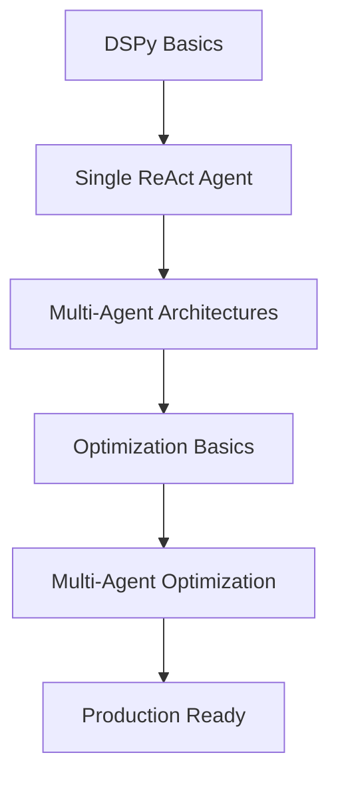

# 🧠 Série Completa: DSPy Multi-Agent Systems & Arquiteturas Cognitivas

## 📚 Visão Geral

Esta série de notebooks oferece um guia completo e prático sobre **sistemas multi-agent** e **arquiteturas cognitivas** usando DSPy, desde conceitos fundamentais até otimização avançada.

---

## 🎯 Notebooks da Série

### 1. **Multi-Agent & Arquiteturas Cognitivas**
📄 `dspy_multiagent_cognitive_architectures.ipynb`

**O que você aprende:**
- Fundamentos de sistemas multi-agent
- 4 arquiteturas cognitivas implementadas:
  - 🎯 **Hierarchical** (Coordenador + Especialistas)
  - 🔄 **Sequential/Pipeline** (Fluxo linear)
  - 💬 **Collaborative/Debate** (Múltiplas perspectivas)
  - 🔍 **Reflexive/Self-Critique** (Auto-melhoria)
- Como implementar qualquer arquitetura from scratch
- Comparação entre arquiteturas

**Nível:** Intermediário/Avançado  
**Tempo:** 45-60 minutos  
**Pré-requisitos:** Notebooks básicos de DSPy ReAct

---

### 2. **Otimização de Arquiteturas Multi-Agent**
📄 `dspy_multiagent_optimization.ipynb`  
📄 `MULTIAGENT_OPTIMIZATION_SUMMARY.md` (Guia complementar)

**O que você aprende:**
- Desafios únicos de otimizar multi-agent
- Técnicas específicas para cada arquitetura:
  - **Hierarchical**: Alternating Optimization
  - **Sequential**: Backward + End-to-End
  - **Collaborative**: Reward Shaping + Multi-Objective
  - **Reflexive**: Actor-Critic Co-Optimization
- MIPRO adaptado para multi-agent
- Datasets e métricas customizadas
- Experimentos comparativos

**Nível:** Avançado  
**Tempo:** 60-90 minutos  
**Pré-requisitos:** Notebook de Multi-Agent + Otimização Avançada DSPy

---

## 🗺️ Roadmap de Aprendizado

### Iniciante → Avançado



**Caminho Recomendado:**

1. **Fundamentos** (se ainda não fez)
   - `dspy_agents_basic_linear_final.ipynb`
   - `dspy_agents_basic_handson_final.ipynb`

2. **Otimização Single Agent** (se ainda não fez)
   - `dspy_agents_advanced_linear_final.ipynb`
   - `dspy_agents_advanced_handson_final.ipynb`

3. **Multi-Agent Systems** ⭐
   - `dspy_multiagent_cognitive_architectures.ipynb`

4. **Multi-Agent Optimization** ⭐⭐
   - `dspy_multiagent_optimization.ipynb`
   - `MULTIAGENT_OPTIMIZATION_SUMMARY.md`

---

## 🎓 O que você vai dominar

Ao completar esta série, você será capaz de:

✅ **Projetar** sistemas multi-agent complexos  
✅ **Escolher** a arquitetura cognitiva apropriada para cada problema  
✅ **Implementar** qualquer arquitetura from scratch com DSPy  
✅ **Otimizar** sistemas multi-agent para produção  
✅ **Criar** métricas e datasets customizados  
✅ **Aplicar** MIPRO e técnicas avançadas  
✅ **Avaliar** trade-offs entre arquiteturas  
✅ **Debugar** sistemas complexos  

---

## 📊 Comparação de Arquiteturas

| Arquitetura | Complexidade | Velocidade | Qualidade | Melhor Para |
|-------------|--------------|------------|-----------|-------------|
| **Hierarchical** | ⭐⭐ | ⚡⚡⚡ | ⭐⭐⭐ | Domínios bem separados |
| **Sequential** | ⭐⭐ | ⚡⚡ | ⭐⭐⭐⭐ | Workflows lineares |
| **Collaborative** | ⭐⭐⭐⭐ | ⚡ | ⭐⭐⭐⭐⭐ | Decisões complexas |
| **Reflexive** | ⭐⭐⭐ | ⚡ | ⭐⭐⭐⭐⭐ | Qualidade crítica |

---

## 🔧 Técnicas de Otimização

### Por Arquitetura

#### Hierarchical
- **Técnica:** Alternating Optimization
- **MIPRO:** 10 candidates, 30 trials
- **Foco:** Coordenador + Especialistas em ciclos

#### Sequential/Pipeline
- **Técnica:** Backward + End-to-End
- **MIPRO:** 8 candidates, 20 trials
- **Foco:** Otimizar de trás para frente, depois refinar E2E

#### Collaborative/Debate
- **Técnica:** Reward Shaping + Multi-Objective
- **MIPRO:** 12 candidates, 40 trials
- **Foco:** Balancear diversidade e consenso

#### Reflexive/Self-Critique
- **Técnica:** Actor-Critic Co-Optimization
- **MIPRO:** 8 candidates, 25 trials
- **Foco:** Convergência rápida com qualidade

---

## 💡 Best Practices

### Desenvolvimento

1. **Start Simple**
   - Comece com arquitetura mais simples (Hierarchical ou Sequential)
   - Adicione complexidade conforme necessário

2. **Iterative Development**
   ```
   Baseline → Individual Agents → Joint Optimization → Production
   ```

3. **Modular Design**
   - Agentes independentes e testáveis
   - Protocolos de comunicação claros
   - Estado compartilhado explícito

### Otimização

1. **Metrics First**
   - Defina métricas customizadas ANTES de otimizar
   - Métricas por agente + métrica composta
   - Inclua eficiência (custo/latência)

2. **Progressive Optimization**
   ```
   BootstrapFewShot → MIPRO (few trials) → MIPRO (full) → Fine-tuning
   ```

3. **Monitoring**
   - Track métricas por agente
   - Monitore coordenação/comunicação
   - Custo e latência em produção

### Production

1. **Observability**
   - Integre Langfuse ou Arize
   - Log todas interações entre agentes
   - Trace decisões de coordenação

2. **Cost Management**
   - Cache quando possível
   - Otimize número de rodadas/iterações
   - Balance qualidade vs custo

3. **Resilience**
   - Retry logic por agente
   - Fallback strategies
   - Graceful degradation

---

## 🚀 Quick Start

### Opção 1: Explorar Arquiteturas

```bash
# Execute o notebook de arquiteturas
jupyter notebook dspy_multiagent_cognitive_architectures.ipynb
```

**Você vai:**
- Ver 4 arquiteturas funcionando
- Testar com exemplos práticos
- Entender quando usar cada uma

### Opção 2: Ir direto para Otimização

```bash
# Execute o notebook de otimização
jupyter notebook dspy_multiagent_optimization.ipynb

# Leia o guia complementar
cat MULTIAGENT_OPTIMIZATION_SUMMARY.md
```

**Você vai:**
- Aprender técnicas avançadas
- Aplicar MIPRO para multi-agent
- Criar métricas customizadas

---

## 📚 Recursos Adicionais

### DSPy
- [Documentação Oficial](https://dspy.ai)
- [Paper DSPy](https://arxiv.org/abs/2310.03714)
- [GitHub](https://github.com/stanfordnlp/dspy)

### Multi-Agent Systems
- [Paper ReAct](https://arxiv.org/abs/2210.03629)
- [Reflexion Paper](https://arxiv.org/abs/2303.11366)
- [AutoGen Framework](https://github.com/microsoft/autogen)
- [Multi-Agent RL Survey](https://arxiv.org/abs/1911.10635)

### Optimization
- [MIPRO Paper](https://arxiv.org/abs/2406.11695)
- [BootstrapFewShot](https://dspy.ai/deep-dive/teleprompter/bootstrap-fewshot/)

### Cognitive Architectures
- [Cognitive Architectures for AI](https://www.cogarch.org/)
- [SOAR Architecture](http://soar.eecs.umich.edu/)

---

## 🤝 Contribuindo

Encontrou um bug ou tem sugestões?
- Abra uma issue
- Submeta um PR
- Compartilhe seus casos de uso!

---

## 🎯 Próximos Tópicos (Em Desenvolvimento)

- 🔜 Multi-Agent com ferramentas externas (APIs, DBs)
- 🔜 Production deployment patterns
- 🔜 A/B testing de arquiteturas
- 🔜 Custos e ROI analysis
- 🔜 Security e safety em multi-agent

---

## 📝 Changelog

### v1.0 (Atual)
- ✅ Notebook de Arquiteturas Cognitivas
- ✅ Notebook de Otimização
- ✅ Guia complementar de otimização
- ✅ 4 arquiteturas implementadas
- ✅ Técnicas de otimização específicas
- ✅ MIPRO adaptado

### Próximas versões
- [ ] Notebooks de production patterns
- [ ] Case studies reais
- [ ] Benchmarks comparativos

---

## 🙏 Agradecimentos

Baseado em:
- DSPy framework da Stanford
- Tutoriais oficiais DSPy
- Pesquisas em multi-agent systems
- Feedback da comunidade

---

## 📄 Licença

Mesmo que o projeto principal.

---

**Happy Building! 🚀**

Questões? Sugestões? Entre em contato ou abra uma issue!

---

## 🔗 Links Rápidos

- [← Voltar para notebooks básicos](dspy_agents_basic_linear_final.ipynb)
- [→ Ver arquiteturas multi-agent](dspy_multiagent_cognitive_architectures.ipynb)
- [⚡ Ir para otimização](dspy_multiagent_optimization.ipynb)
- [📖 Ler guia de otimização](MULTIAGENT_OPTIMIZATION_SUMMARY.md)

